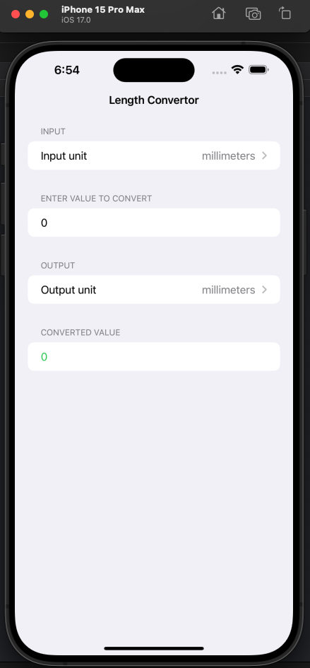
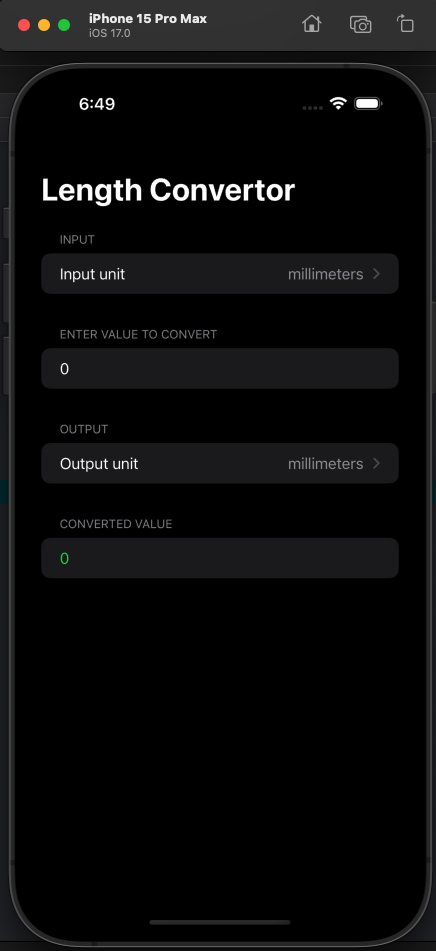
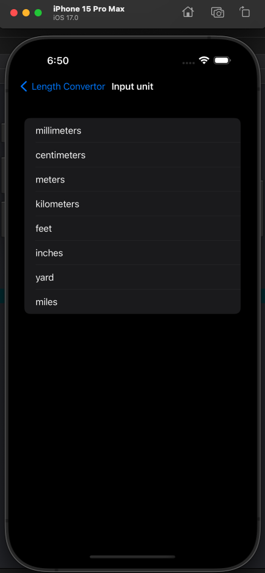
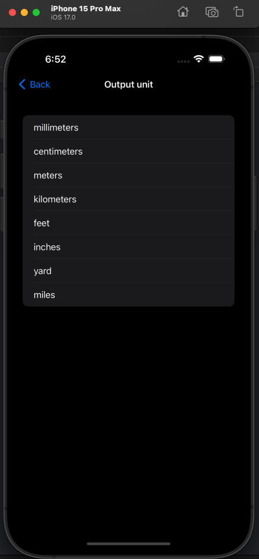
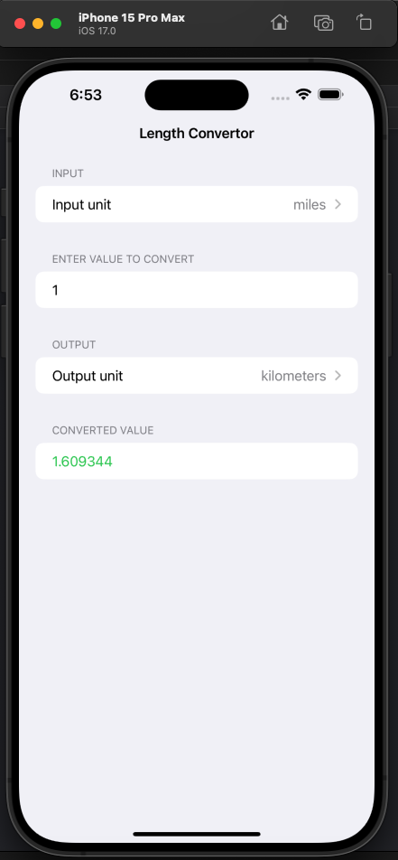
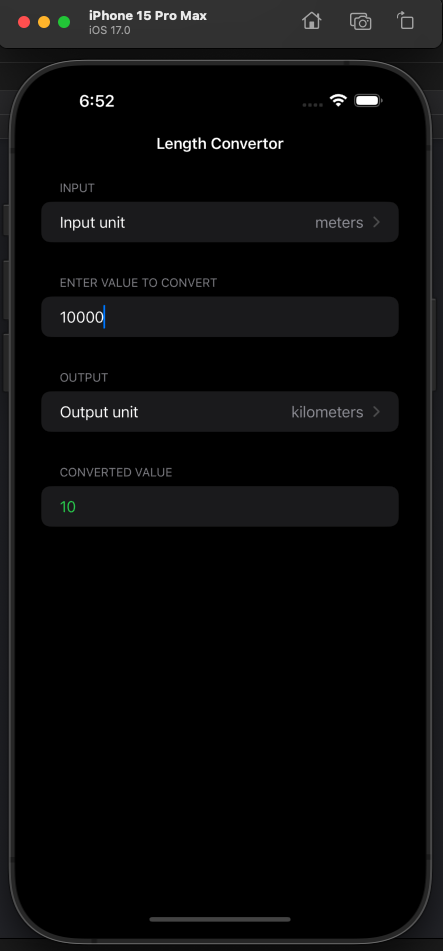

# LengthConvertor

This app is a length convertor app built using Swift and SwiftUI.
The units it can convert are millimeters, centimeters, meters, kilometers, feet, inches, yards, miles, etc
The UI is simple as I have started learning iOS development recently. More good projects to come....

## Technologies used:

## Screen UI

## Navigation for input and output units

## Output Screens

## Made By
[NISHANT VILKAR](https://github.com/almightynv)
- [Linkedin](https://www.linkedin.com/in/nishantvilkar076/)
